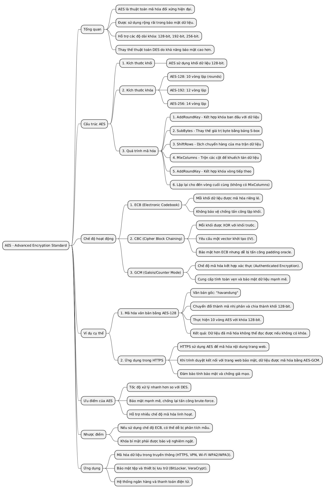
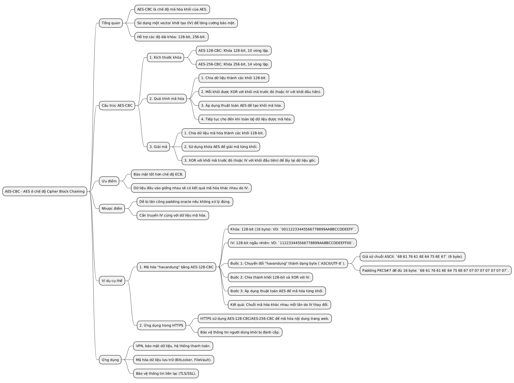
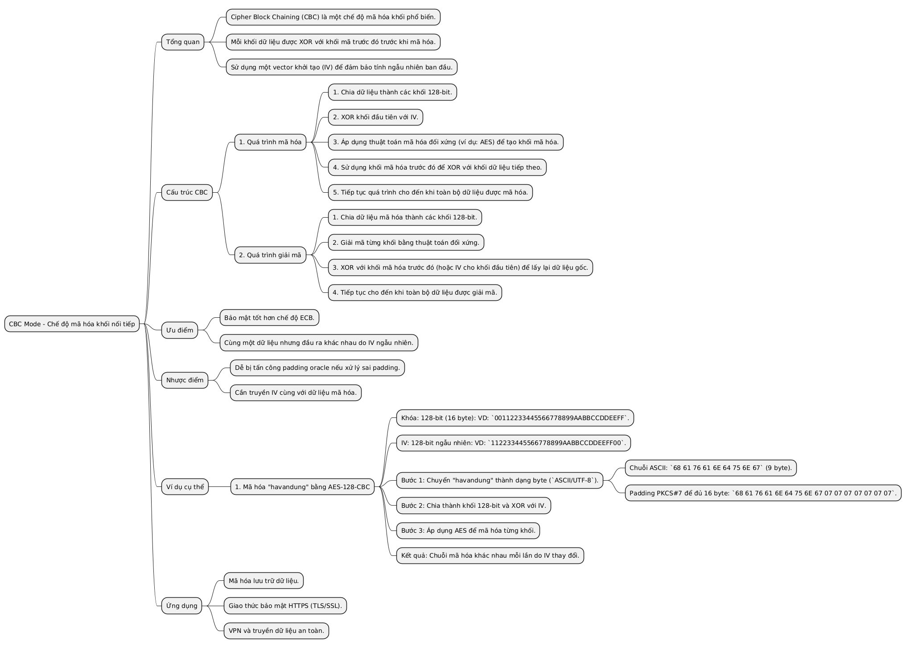
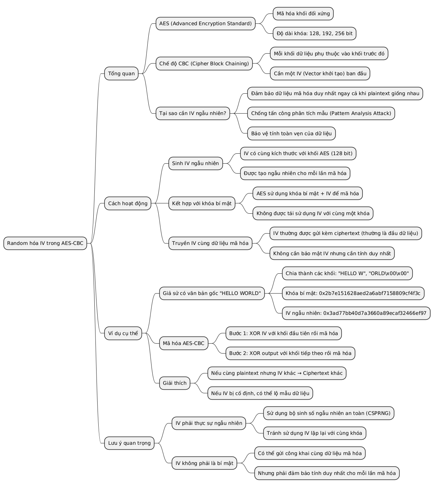
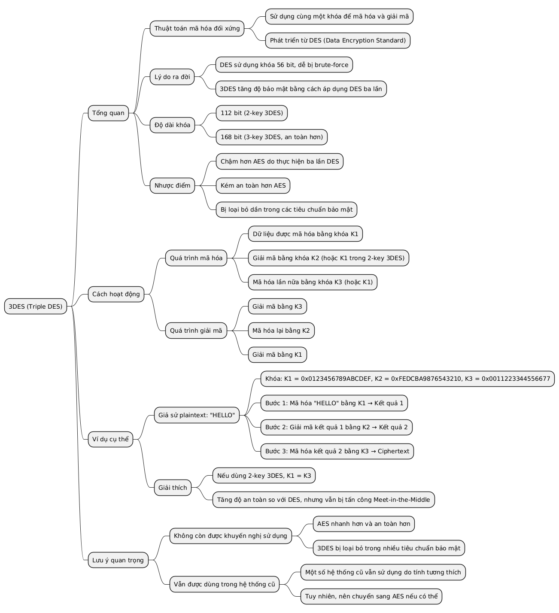
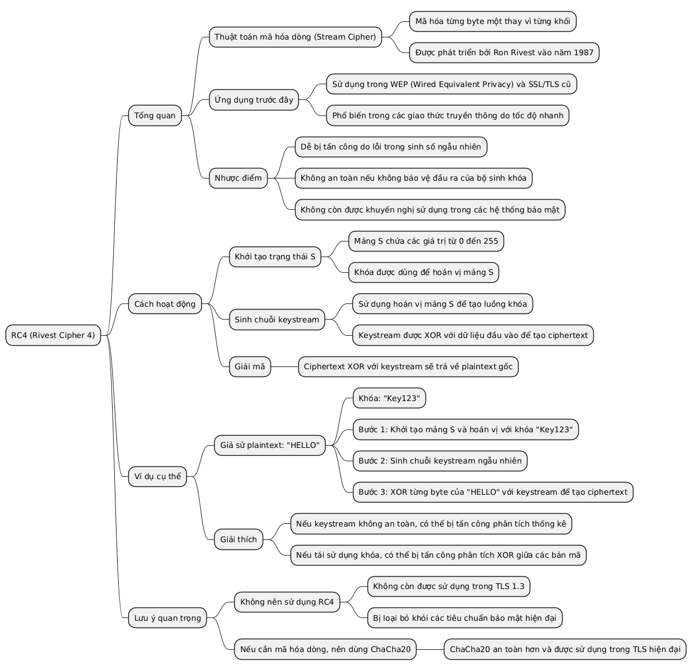
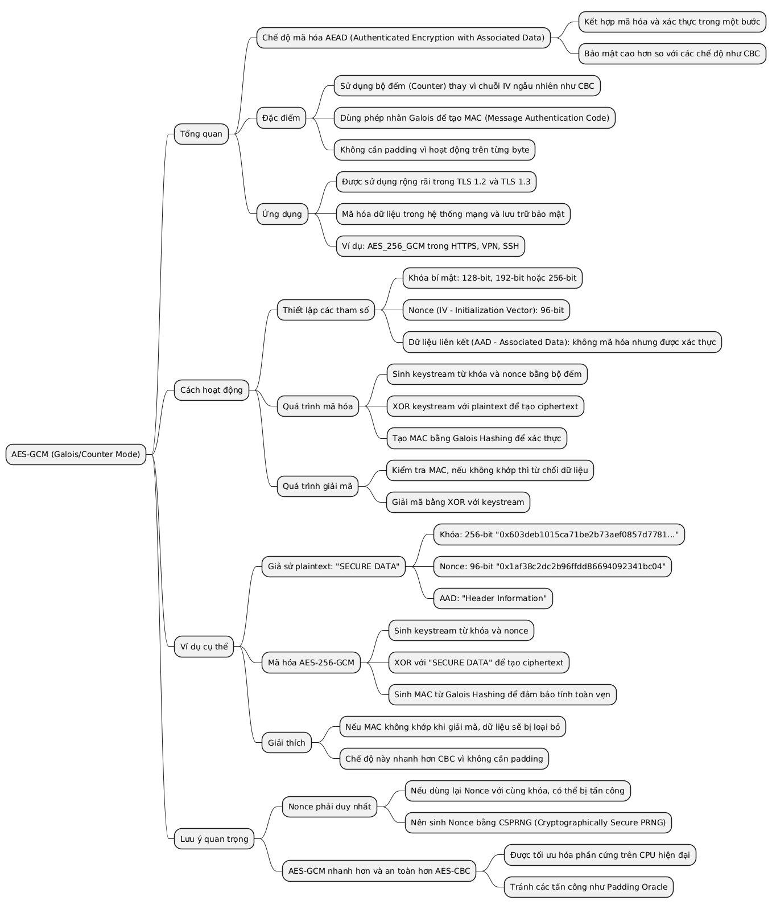
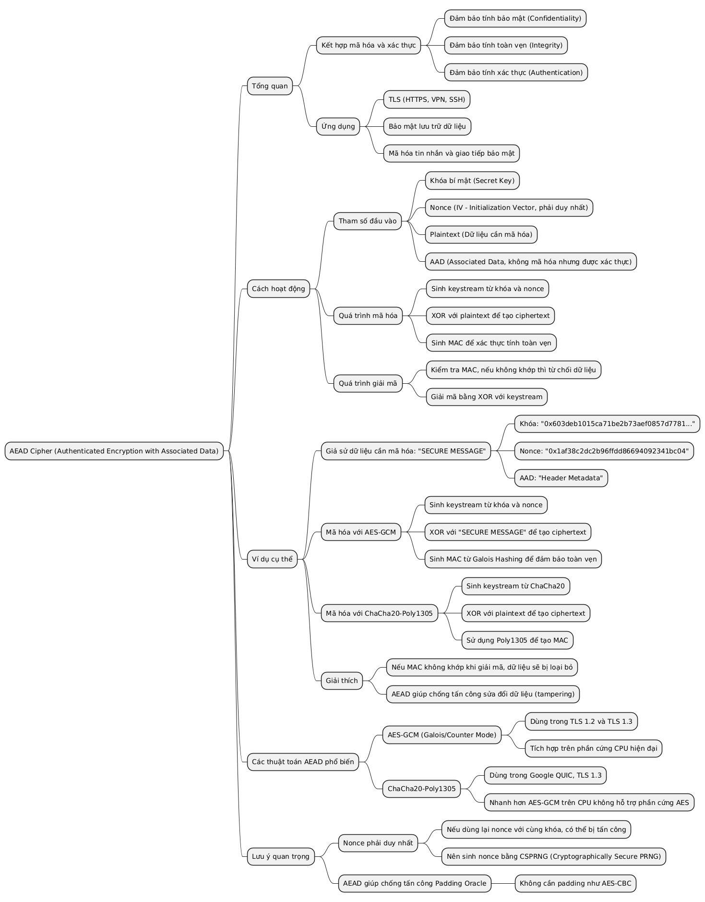
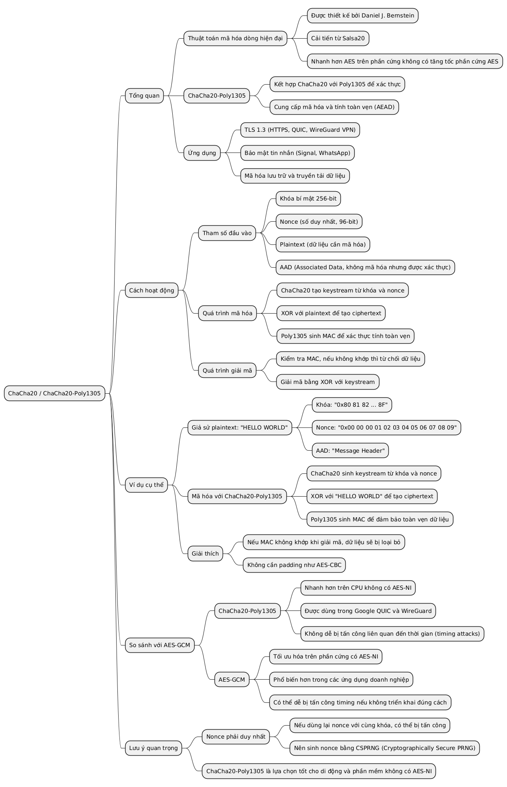

# Các thuật toán mã hóa và chế độ

## AES (Advanced Encryption Standard)
- Thuật toán mã hóa đối xứng hiện đại.
- Phổ biến với độ dài khóa **128-bit** hoặc **256-bit**.

---

## AES-128-CBC / AES-256-CBC
- **CBC (Cipher Block Chaining) Mode**: Mã hóa khối nối tiếp, mỗi khối được mã hóa dựa trên khối trước.
- Sử dụng khóa **128-bit** hoặc **256-bit**.

---

## CBC Mode
- Chế độ mã hóa khối, cần IV (Vector khởi tạo) để tăng tính bảo mật.

---

## Random hóa IV trong AES-CBC
- Vector khởi tạo (IV) được tạo ngẫu nhiên.
- Đảm bảo tính duy nhất của dữ liệu mã hóa trong CBC.

---

## 3DES
- Thuật toán mã hóa đối xứng cũ hơn AES.
- Kém an toàn hơn và tốc độ chậm hơn.

---

## RC4
- Thuật toán mã hóa dòng (stream cipher) cũ.
- Hiện không an toàn và không được khuyến nghị sử dụng.

---

## AES-GCM (Galois/Counter Mode)
- Chế độ mã hóa hiện đại.
- Kết hợp mã hóa và xác thực (**AEAD - Authenticated Encryption with Associated Data**).
- Ví dụ: `AES_256_GCM`.

---

## AEAD Cipher (Authenticated Encryption with Associated Data)
- Loại mã hóa kết hợp **mã hóa** và **xác thực**.
- Ví dụ: **AES-GCM**, **CHACHA20-POLY1305**.

---

## CHACHA20 / CHACHA20-POLY1305
- Thuật toán mã hóa dòng hiện đại.
- Thay thế **RC4**.
- Thường kết hợp với **Poly1305** để xác thực dữ liệu.

