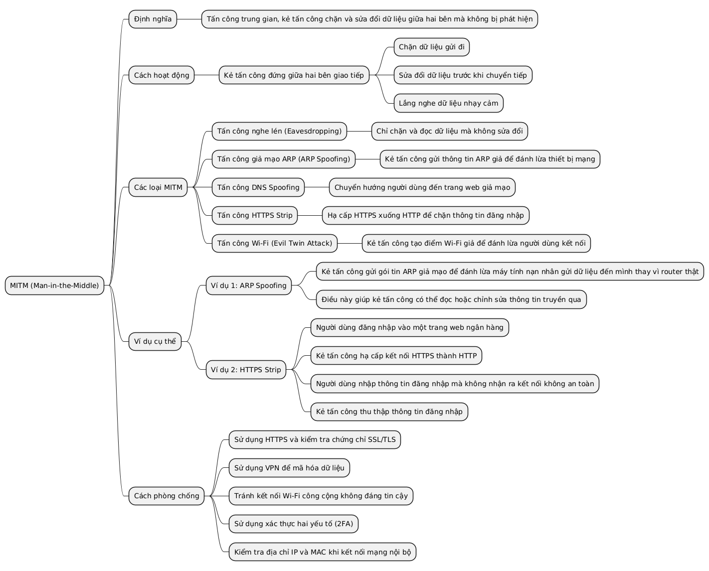
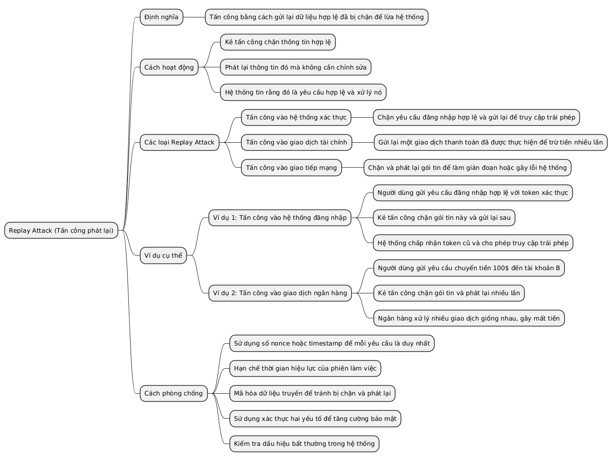
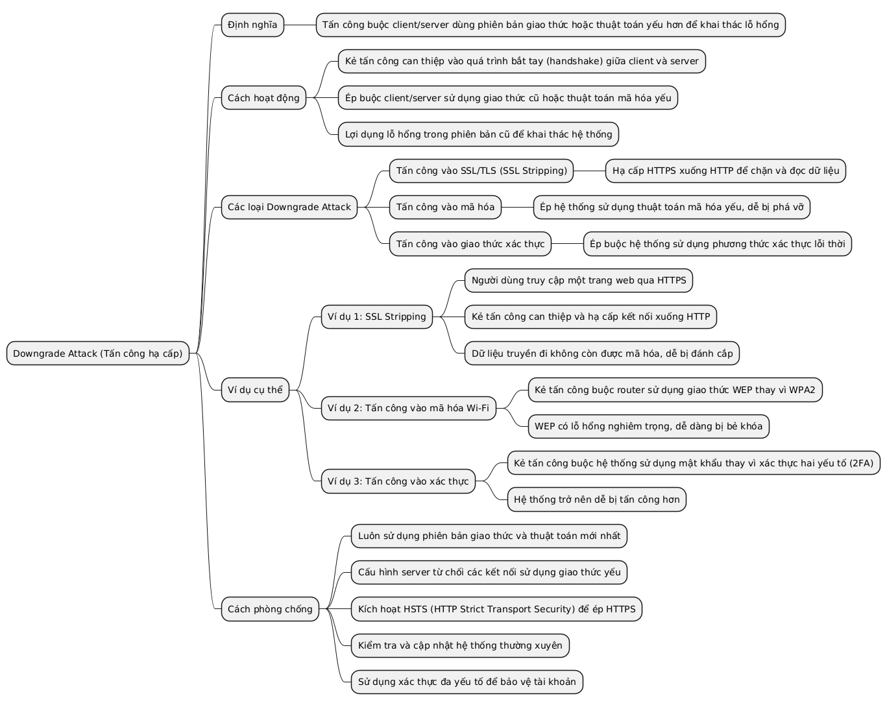
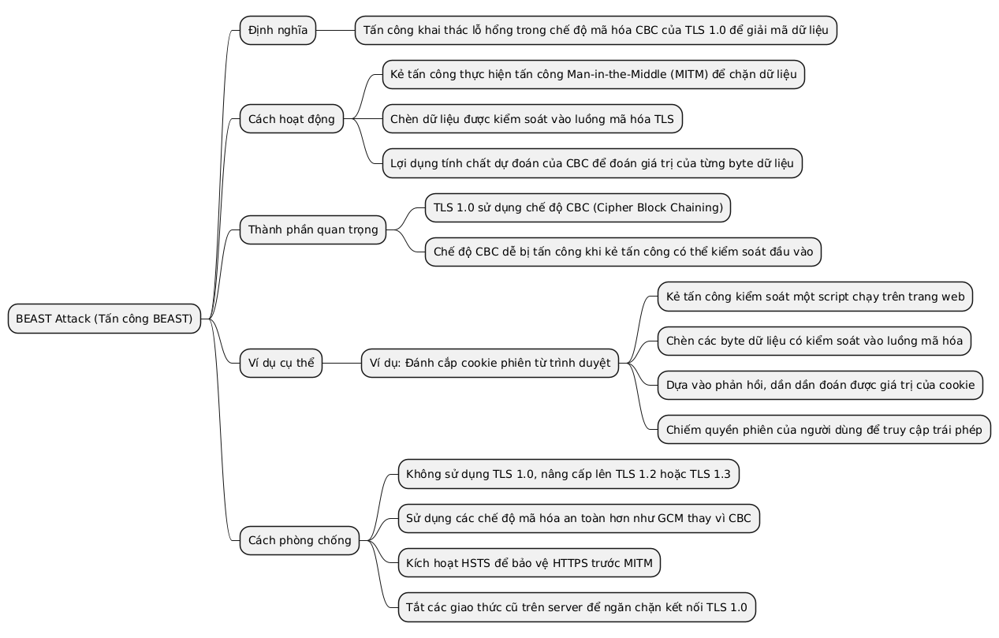
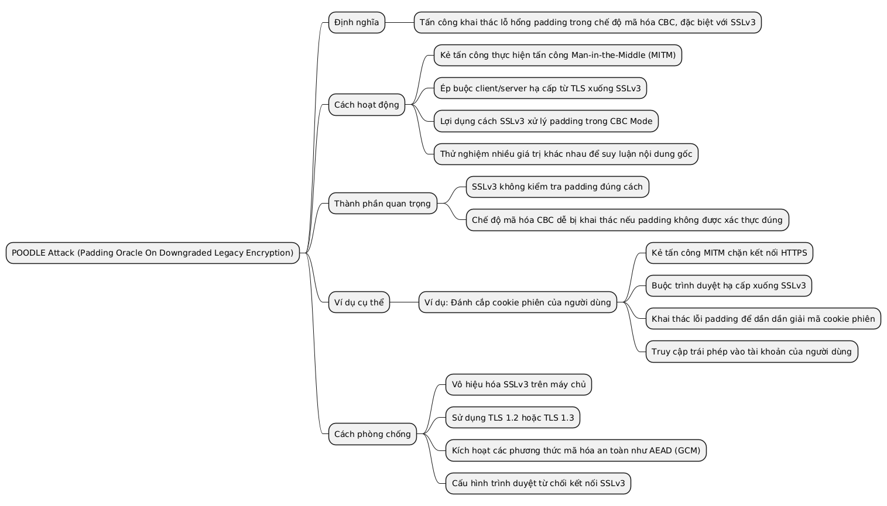
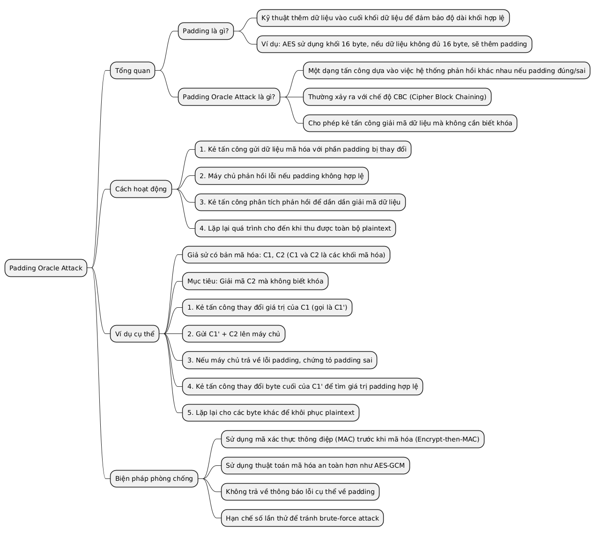
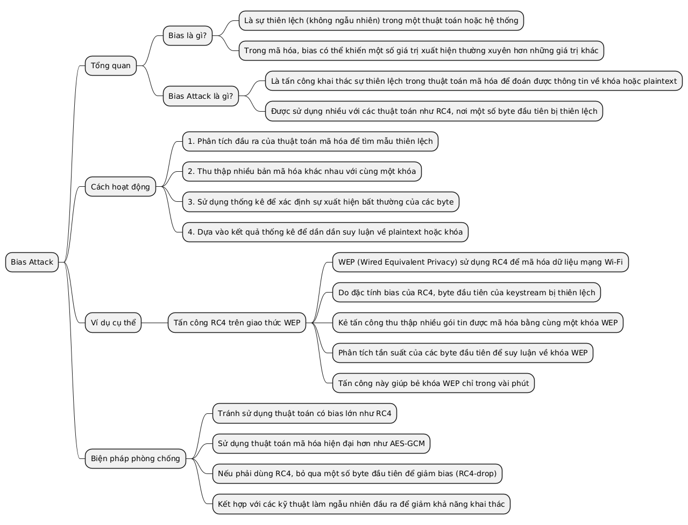
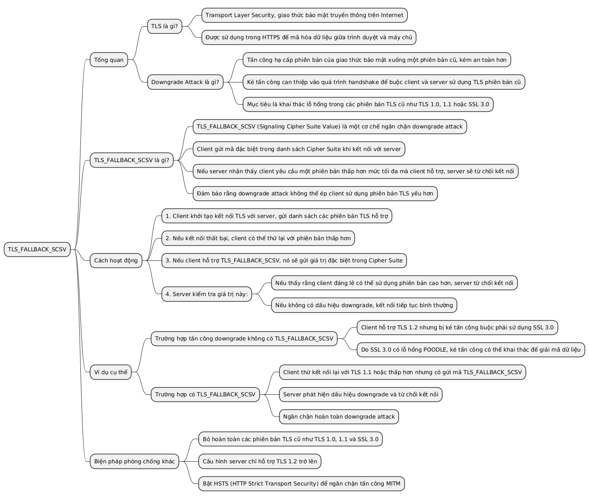

### MITM (Man-in-the-Middle)
Tấn công trung gian, kẻ tấn công chặn và sửa đổi dữ liệu giữa hai bên.

---

### Replay Attack
Tấn công bằng cách gửi lại dữ liệu hợp lệ đã bị chặn để lừa hệ thống.

---

### Downgrade Attack
Tấn công buộc client/server dùng phiên bản giao thức hoặc thuật toán yếu hơn.

---

### BEAST Attack
Tấn công khai thác lỗ hổng trong CBC Mode của TLS 1.0.

---

### POODLE Attack (Padding Oracle On Downgraded Legacy Encryption)
Tấn công khai thác lỗ hổng padding trong CBC Mode, đặc biệt với SSLv3.

---

### Padding Oracle / Khai thác padding
Tấn công dựa trên cách hệ thống xử lý padding trong mã hóa khối.

---

### Bias Attack
Tấn công khai thác sự thiên lệch trong thuật toán mã hóa (như RC4).

---

### TLS_FALLBACK_SCSV
Cơ chế ngăn chặn downgrade attack bằng cách báo hiệu rằng client không chấp nhận phiên bản thấp hơn.

