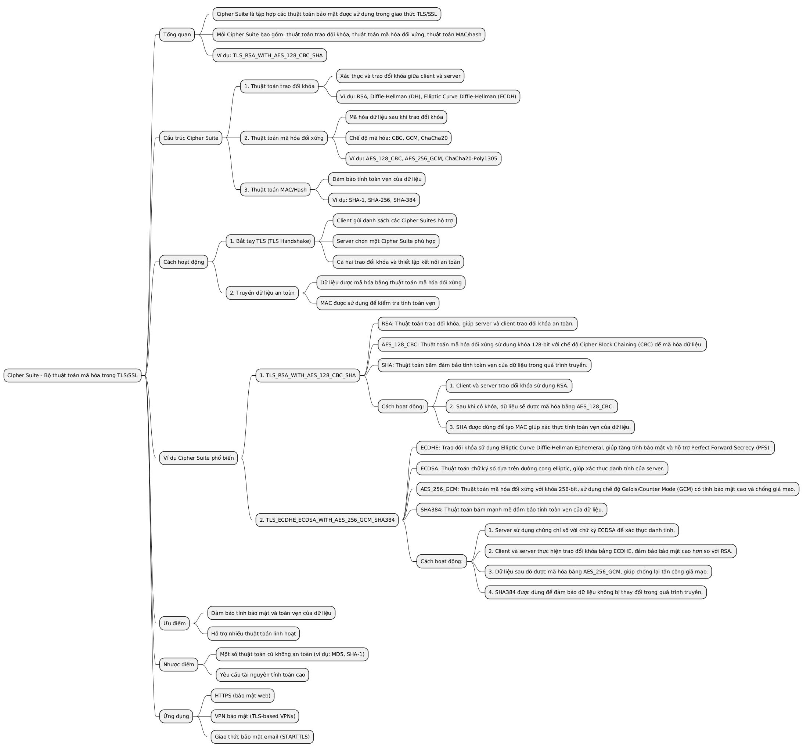
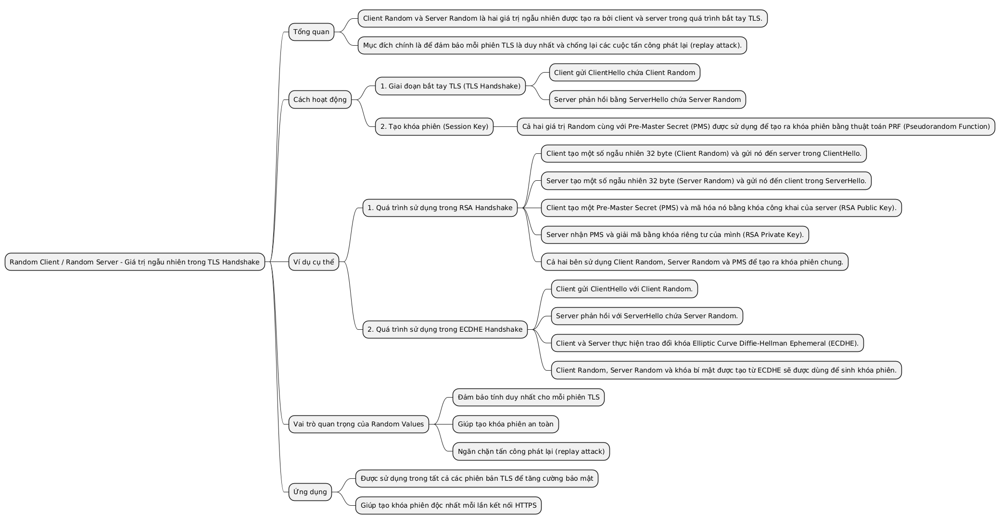
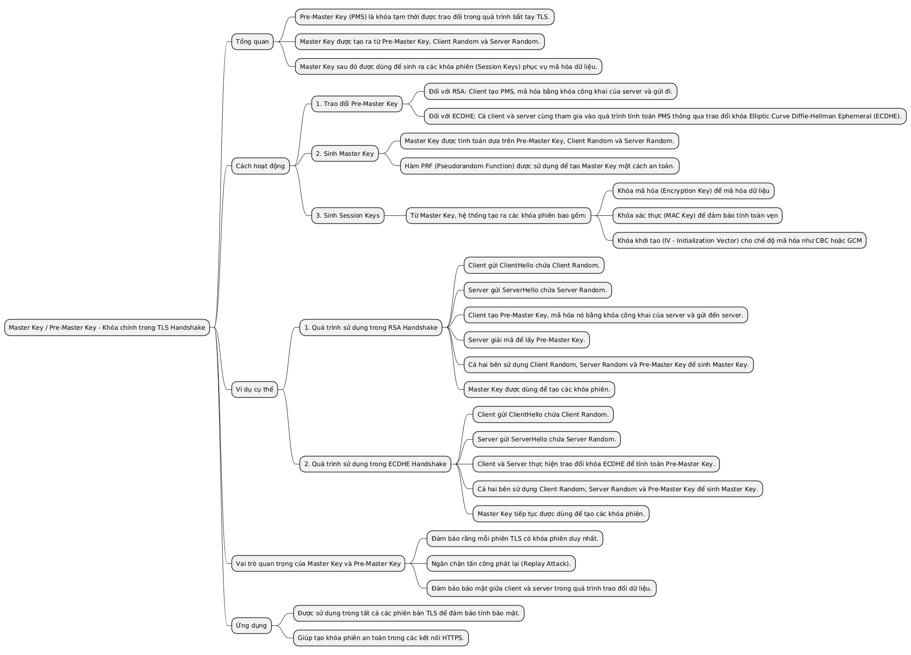
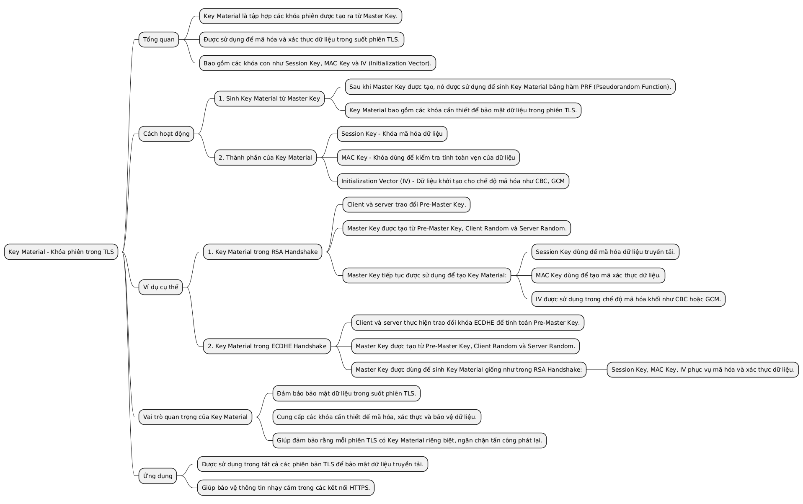
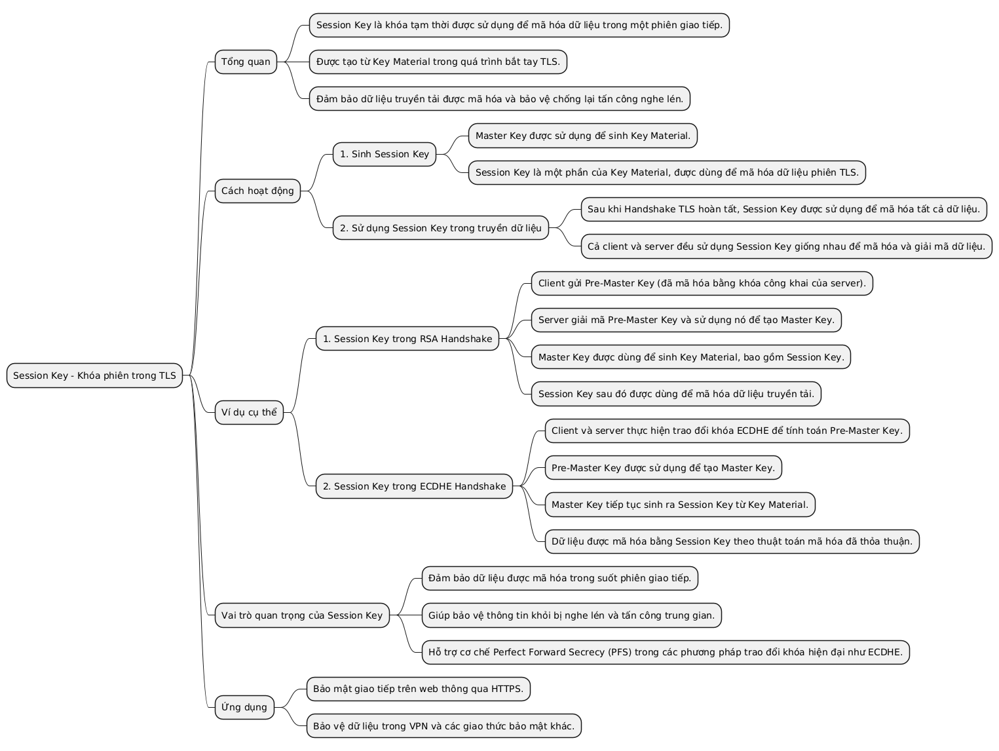
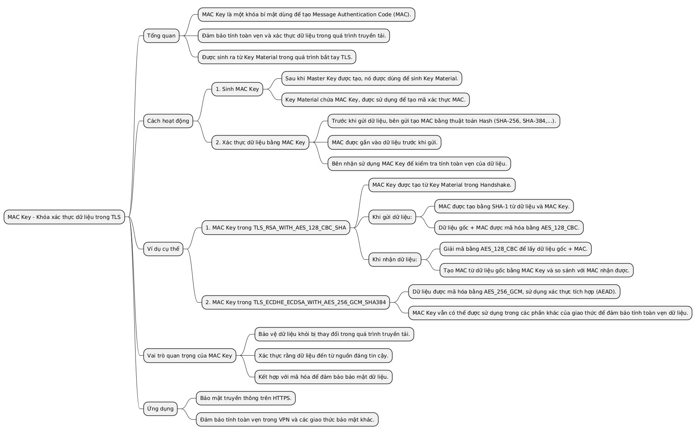
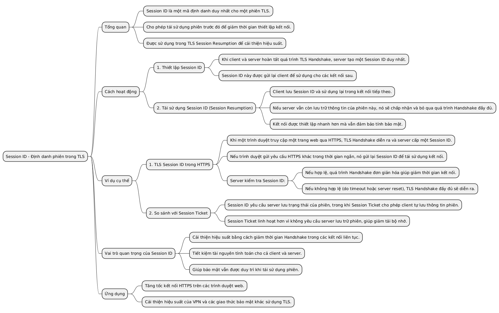
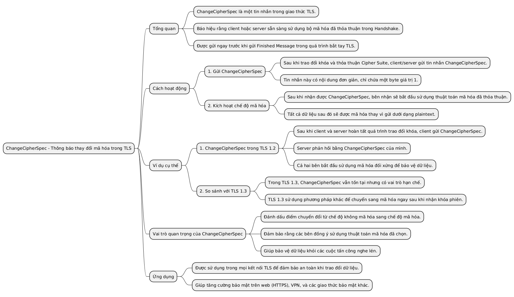

# Thành phần cơ bản trong giao thức TLS/SSL

## Cipher Suite
- Bộ thuật toán mã hóa được sử dụng trong TLS/SSL.
- Bao gồm các thuật toán mã hóa, hash, và trao đổi khóa.
- Ví dụ: `TLS_RSA_WITH_AES_128_CBC_SHA`.

---

## Random Client / Random Server
- Các giá trị ngẫu nhiên do client và server tạo ra.
- Đảm bảo tính duy nhất trong quá trình trao đổi khóa.

---

## Master Key / Pre Master Key
- **Pre Master Key**: Được tạo trong quá trình bắt tay TLS.
- **Master Key**: Sinh ra từ Pre Master Key, dùng để tạo các khóa phiên.

---

## Key Material (Khóa phiên)
- Tập hợp các khóa được tạo từ Master Key.
- Bao gồm **Session Key** và **MAC Key**.

---

## Session Key
- Khóa tạm thời dùng để mã hóa dữ liệu trong một phiên giao tiếp.

---

## MAC Key
- Khóa dùng để tạo **MAC**.
- Đảm bảo tính toàn vẹn dữ liệu.

---

## Session ID
- Định danh phiên TLS.
- Giúp tái sử dụng kết nối TLS mà không cần bắt tay lại.

---

## ChangeCipherSpec
- Tin nhắn trong TLS.
- Báo hiệu rằng các bên đã sẵn sàng sử dụng bộ mã hóa đã thỏa thuận.

